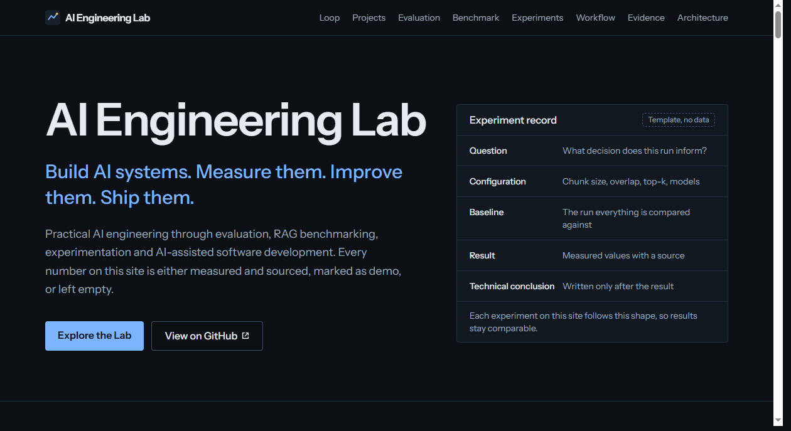

# AI Engineering Lab

**Build AI systems. Measure them. Improve them. Ship them.**

A static technical hub that connects three AI engineering projects into one workflow: build, evaluate, benchmark, improve, ship.



## What it is and why it exists

Most AI portfolios are a list of demos. This site presents an engineering method instead: systems are built, measured against fixed datasets, compared under identical conditions, and changed only when the data supports it.

The rule that shapes the whole codebase: **no fabricated results.** Every result set is one of three states.

| Status | Meaning | How it renders |
| --- | --- | --- |
| `measured` | Real numbers, must name a `source` | Values plus a "Measured" badge and source line |
| `demo` | Illustrative numbers, off by default | Amber values, a banner, and "Demo values" badge |
| `empty` | Nothing recorded yet | Dashes and hatched tracks. Never zero |

`src/data/integrity.test.ts` enforces this: empty sets contain no numbers, measured sets need a source, and a conclusion cannot exist on an experiment that is not complete.

## Projects

| Project | Purpose | Repository |
| --- | --- | --- |
| AI Evaluation Platform | Measure AI systems before shipping them | https://github.com/Lazaro549/ai-evaluation-platform |
| AWS AI / RAG Benchmark | Compare RAG configurations by measurable performance | https://github.com/Lazaro549/AWS-AI-Generative |
| Claude Code workflow | AI-assisted development as a reproducible workflow | https://github.com/Lazaro549/claude-code-starter |

Project facts (technologies, what each system measures) were taken from each repository's README. Static metadata only, no live GitHub API calls.

## Architecture

```
src/
  data/         typed content: projects, loop, experiments, results, evidence
  components/   one component per section, plus shared ui.tsx
  lib/          pure helpers (formatting, chunking arithmetic, useInView)
```

Components contain no project content. See [docs/ARCHITECTURE.md](docs/ARCHITECTURE.md).

## Development

Requires Node 20 or newer.

```bash
npm install
npm run dev        # http://localhost:5173
npm run check      # lint, typecheck, tests, production build
```

Scripts: `dev`, `build`, `preview`, `lint`, `typecheck`, `test`, `check`.

## Add a project

Append an object to `src/data/projects.ts`. Cards, footer links and loop references pick it up. Give it a unique `id` and use it in `src/data/loop.ts` where relevant.

## Add an experiment

Append to `src/data/experiments.ts`:

1. Set `question`, `varied` (the one parameter that changes) and `method`.
2. List every parameter in `configuration`. Mark the rest `held constant`.
3. Leave `result.metrics` values as `null` and `status: 'planned'` until it runs.

To record the outcome: fill baseline and variant values, set `result.status: 'measured'` with a `source` (report file or run id), write `comparison` and `conclusion`, and set `status: 'complete'`.

## Add benchmark or evaluation results

- Benchmark: edit `benchmarkResults` in `src/data/benchmark.ts`. Row `configId` matches the configuration ids (`a`, `b`).
- Evaluation: edit `evaluationResults` in `src/data/evaluation.ts`.
- Set `status: 'measured'` and a `source`. The demo toggle keeps working from the separate `*Demo` sets, and should be removed once real data exists if you prefer.
- Evidence: push entries (`label`, `value`, `source`, `date`) into a category in `src/data/evidence.ts`.
- Workflow: set `value` and `source` on entries in `src/data/workflow.ts`.

Suggested sources: reports exported by the AI Evaluation Platform (JSON, CSV, Markdown) and JSON reports written by `evaluation/` in AWS-AI-Generative.

## Environment variables

None required. Optional: `VITE_BASE` sets the base path for sub-path hosting (for example `/ai-engineering-lab/` on GitHub Pages).

## Build and deploy

```bash
npm run build      # outputs dist/
npm run preview    # serve dist/ locally
```

`dist/` is static and works on any static host.

- **GitHub Pages:** `VITE_BASE=/ai-engineering-lab/ npm run build`, then publish `dist/`.
- **Netlify or Vercel:** build command `npm run build`, output directory `dist`.

## Donations

If you'd like to support this project:

- 🇦🇷 ARS (Argentina)  
  Alias: `lazaro.503.alaba.mp`

- 🌎 USD (Argentina only, local transfers)  
  Alias: `ahogada.duras.foca`
